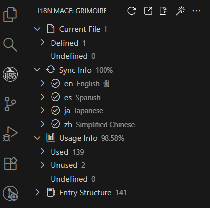
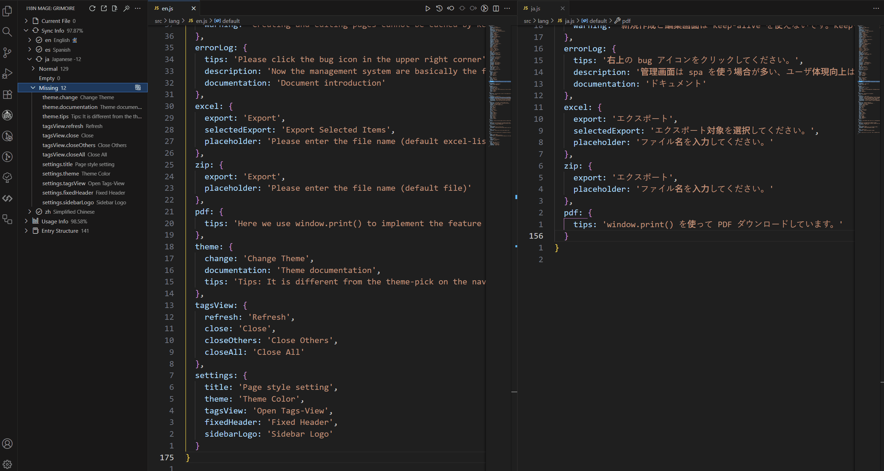
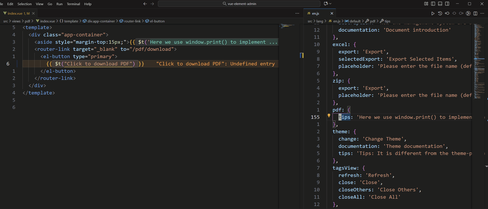
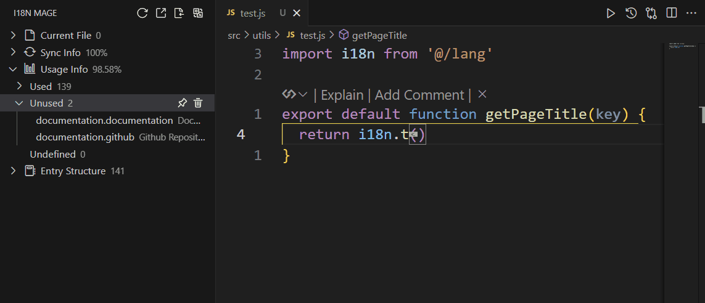
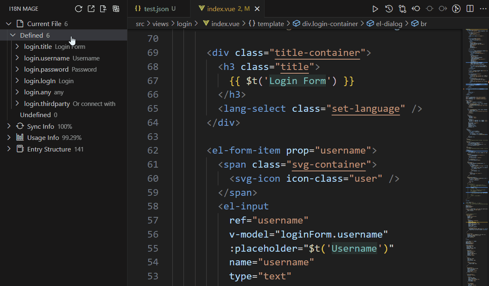

# 🪄 i18n Mage - 前端国际化助手

🌍 [English](./README.md) | [简体中文](./README.zh-CN.md)

`i18n Mage` 是一款专为前端开发者设计的 VS Code 插件，旨在全面提升国际化开发体验。它支持 Vue I18n、React I18next 等主流国际化框架，提供自动补全翻译、内联提示、词条管理、Excel 导入导出等一系列实用功能，让国际化工作变得更轻松、更高效。

## 📚 目录

- [✨ 核心功能](#-核心功能)
- [⚡ 快速开始](#-快速开始)
- [🧰 配置说明](#-配置说明)
- [🎹 命令与快捷键](#-命令与快捷键)
- [🚀 高级用法](#-高级用法)
- [❓ 常见问题](#-常见问题)
- [🔧 配置详解](#-配置详解)
- [🤝 贡献指南](#-贡献指南)

## ✨ 核心功能

### 🌳 查看翻译词条总览

启用插件后，VS Code 侧边栏会新增一个“国际化巫师”图标。点击后打开的面板会显示当前项目中的翻译词条信息，包括：

- 当前打开文件中的词条情况
- 各语言文件的同步情况（总词条数、缺失数等）
- 词条使用情况（已使用、未使用、未定义）
- 翻译词条的树状结构
- 功能按钮（刷新、导出、导入、排序、修复等）



### 🧠 翻译内联提示

- 在翻译函数调用处显示实际翻译内容
- 支持自定义样式（颜色、最大长度等）
- 可通过快捷键随时开关


### 🚧 缺漏翻译一键补全

- 集成 DeepL、谷歌、百度、腾讯、DeepSeek 翻译服务
- 自动补全缺失翻译，支持预览与人工校验



### 🧩 未定义词条自动修复

- 智能识别未定义词条
- 若文案与已有词条一致，自动替换为对应 key
- 否则，生成新词条并写入语言文件，支持自定义命名风格

💡 使用前请确保：在翻译服务配置中勾选相关修复设置项



### 🕵️ 未使用词条检测

- 全局分析词条使用情况
- 支持动态拼接 key 的模式匹配
- 可删除未使用词条或手动标记为“已使用”



### 📊 Excel 导入导出

- 可将翻译词条导出为 Excel 文件，供翻译团队使用
- 支持从 Excel 导入翻译，自动写入语言文件


### 📋 复制词条数据

- 一键复制当前页词条键值对，便于模块迁移



---

## ⚡ 快速开始

### 安装插件

您可以通过以下任一方式安装 `i18n Mage` 插件：

#### 🔍 VS Code 内搜索安装

1. 打开 VS Code
2. 进入扩展市场（快捷键 `Ctrl+Shift+X` / `Cmd+Shift+X`）
3. 搜索框中输入：`i18n Mage`
4. 找到插件后点击「安装」

#### ⌨ 命令行一键安装

直接运行以下命令：

```bash
ext install jensen-wen.i18n-mage
```

#### 🌐 手动安装

访问 [插件市场页面](https://marketplace.visualstudio.com/items?itemName=jensen-wen.i18n-mage) 查看详情并安装。

### **打开翻译视图**

- 启动插件后，会自动扫描项目中的语言文件目录。
- 在 VS Code 侧边栏点击插件图标，即可打开插件视图面板。
- 如未识别出语言目录，可点击“设置语言文件目录”按钮进行选择。


### **设置语言**

- 在插件面板中，“同步情况”区域会显示所有有效的语言文件名称。
- 可右键将某语言设置为“显示语言”或“翻译源语言”。
- 若插件无法识别文件语言，可手动标记语言类型。


### **配置翻译服务（可选）**

- 插件支持 DeepL、谷歌、DeepSeek、百度、腾讯服务调用。
- 配置路径：`设置 -> 扩展 -> i18n Mage -> 翻译服务`

---

## 🧰 配置说明

插件提供超过 60 项配置项，主要分为以下几类：

- 通用设置（启用插件、显示语言等）
- 国际化框架支持（翻译函数名、命名空间、插值样式等）
- 翻译服务（密钥、翻译源语言、启用未定义词条修复等）
- 检查规则（扫描文件、启用自动分析等）
- 写入规则（key 风格、引号样式、缩进等）
- 内联提示样式（颜色、最大展示字符数等）
- 工作区配置（项目路径、忽略目录、忽略语言文件等）

📌 可通过 VS Code 设置面板统一管理，也支持 `.vscode/settings.json` 中单独配置。

📘 全部配置项请参阅 [完整配置文档](#-配置详解)

---

## 🎹 命令与快捷键

| 命令 ID                            | 功能说明           | 快捷键     |
| ---------------------------------- | ------------------ | ---------- |
| `i18nMage.check`                   | 检测词条信息       | Ctrl+Alt+C |
| `i18nMage.fix`                     | 一键修复           | Ctrl+Alt+F |
| `i18nMage.toggleInlineTranslation` | 切换翻译内联提示   | Ctrl+Alt+D |
| `i18nMage.export`                  | 导出词条为 Excel   | -          |
| `i18nMage.import`                  | 从 Excel 导入词条  | -          |
| `i18nMage.sort`                    | 对语言文件词条排序 | -          |
| ...                                | ...                | ...        |

> 💡 全部命令可通过命令面板（Ctrl+Shift+P）调用。

---

## 🚀 高级用法

### 🔠 自动翻译含变量的文本

插件针对国际化转换函数可传入变量的特性做了适配（需要配置具体的国际化框架）。

```js
import { i18n } from "@/i18n.js";
const variable = "变量";
const list = [
  i18n.t(`这是含有变量{name}的文本`, { name: variable }),
  i18n.t(`这也是含有变量${variable}的文本`),
  i18n.t("这也是含有变量" + variable + "的文本"),
  i18n.t("这是含有多个变量" + variable + variable + "的文本"),
  i18n.t("这也是" + variable + "含有多个变量" + variable + "的文本")
];
```

插件不仅支持 `t()` 原本的传参规则，而且还能直接对模板字符串或用 `+` 拼接的字符串进行分析匹配。假设上面这段代码所使用的框架为 `vue-i18n`，则这五个未定义的文案会被修正成如下：

```js
import { i18n } from "@/i18n.js";
const variable = "变量";
const list = [
  i18n.t(`thisIsTextContainingVariableName`, { name: variable }),
  i18n.t(`thisIsAlsoTextContainingVariable0`, [variable]),
  i18n.t("thisIsAlsoTextContainingVariable0", [variable]),
  i18n.t("testText01", [variable, variable]),
  i18n.t("testText02", [variable, variable])
];
```

### 🚫 忽略代码块

插件除了可以忽略文件和目录外，还可以忽略代码块。在需要忽略的代码块前添加 `i18n-mage-disable` 标志字符即可。插件会忽略 `i18n-mage-disable` 后的内容，直到遇见下一个 `i18n-mage-enable` 标志为止。

```js
import { i18n } from "@/i18n.js";
// i18n-mage-disable
function t(params) {
  return params;
}
t("名称为 t 的非国际化转换函数");
// i18n-mage-enable
const errorInfo = i18n.t("保存失败");
```

### 🔁 重译单个词条

如果想更改某个词条的文案，但不想修改原有的词条键名，可以启用 `i18n-mage.writeRules.enableKeyTagRule` 配置，在词条的文件引入处使用 `%` 对键名进行包裹，接着输入新的翻译内容（即 `%key%text` 的形式）后运行修复命令即可。

---

## ❓ 常见问题

### Q：翻译服务如何选择？

插件目前支持谷歌、DeepL、百度、腾讯和 DeepSeek 翻译。

1. 谷歌翻译：翻译质量较高，支持多语言，无需账号配置，但需要科学上网。由于谷歌翻译 API 的调用频率限制，在短时间内的多次调用可能让发起请求的 IP 地址被限制，从而一段时间内无法再进行调用。遇到这种情况时，可以选择切换代理地址或使用其他 API 进行翻译。

2. DeepL：以精准流畅著称，尤其适合欧美语言互译，提供免费和付费版本。

3. 百度翻译：翻译质量良好，调用 API 服务前需要先在[百度翻译开放平台](https://fanyi-api.baidu.com/choose)开通通用文本翻译服务，并完成个人认证以此使用高级版服务。高级版拥有每月 100 万字符的免费调用额度，并支持 28 种语言的互译。

4. 腾讯翻译：翻译质量良好，调用 API 服务前需要先访问[腾讯云控制台](https://console.cloud.tencent.com/cam)进行注册登录，腾讯翻译拥有每月 500 万字符的免费调用额度，并支持 17 种语言。

5. DeepSeek：AI 翻译质量高，支持多语言，调用 API 服务前除了需要先在[DeepSeek 官网](https://platform.deepseek.com)注册账号外，还需要进行充值（每百万 tokens 输入预计仅花费 0.5 元到 2 元）。由于 AI 输出结果存在一定随机性，不建议用其一次性翻译数量较多的文案，以免文案匹配出错。

### Q：支持哪些语言文件格式？

支持 `.json` / `.json5` / `.js` / `.ts` 等。

### Q：词条支持哪些引入方式？

插件主要基于国际化转换函数函数进行词条识别，因此推荐使用 `t()` 函数引入词条（函数名称可自行配置）。函数参数支持拼接的方式，例如 `t("prefix." + key + ".suffix")`。插件会提取其正则表达式用以匹配，当匹配多个词条时，这些词条都会被判定为已使用，而在进行内联翻译提示时，则仅显示第一个匹配结果。
另外，在统计词条使用信息时，考虑到 key 可能没有被直接传入 `t()` 函数中的情况，插件还支持批量读取文件中字符串类型的值作为可能被使用的词条 key。
而在进行翻译内联提示时，插件则仅支持 `t()` 函数的调用，且 `t()` 函数内只允许包含一个词条 key，若存在多个词条 key，例如 `t(bool ? 'key1' : 'key2')`，则插件不会对其进行翻译的显示。

### Q：未定义词条未被修复怎么办？

如果插件没有对未定义的词条进行修复，请检查以下几项：

1. 确认已启用未定义词条自动匹配与翻译功能。
2. 插件默认启用了翻译前语言校验功能，请确认未定义词条文案所属语言与翻译源语言一致。

---

## 🔧 配置详解

### 通用

#### `i18n-mage.general.enable`

启用插件功能。

#### `i18n-mage.general.previewChanges`

启用翻译更改预览功能。开启后，在修复或导入翻译时，插件会先显示待更改的词条数据，供您确认或调整修改内容后再应用。

#### `i18n-mage.general.displayLanguage`

指定内联翻译提示和信息面板的默认语言来源。

#### `i18n-mage.general.fileExtensions`

指定需要扫描的文件扩展名。

#### `i18n-mage.general.sortOnExport`

导出翻译为表格时的排序规则。支持按词条键名首字母排序和按词条首次出现的源文件位置排序。

### 国际化特性

#### `i18n-mage.i18nFeatures.framework`

选择使用的国际化框架：如 `vue-i18n`、`react-i18next` 等。

#### `i18n-mage.i18nFeatures.translationFunctionNames`

指定国际化转换函数名称列表，默认为 `t`。当框架为 `vue-i18n` 时，会强制启用 `t` 和 `tc`。

#### `i18n-mage.i18nFeatures.namespaceStrategy`

控制翻译键命名空间的生成策略。可选值：`'auto'` | `'full'` | `'file'` | `'none'`

**选项说明：**

- **`'auto'` (自动推断)**:

  - 自动选择词条使用率不为 0 的命名空间策略

- **`'full'` (完整路径)**:

  - 使用语言文件的完整相对路径作为命名空间前缀
  - 路径分隔符（如 `/`）会被替换为点号（`.`）
  - 示例：文件 `zh/modules/components.json` 会生成前缀 `modules.components`
  - 适合复杂项目结构，确保键的唯一性

- **`'file'` (仅文件名)**:

  - 仅使用文件名（不含扩展名）作为命名空间前缀
  - 示例：文件 `zh/modules/components.json` 会生成前缀 `components`
  - 适合简单项目结构，键较短但可能不够唯一

- **`'none'` (无命名空间)**:
  - 不使用任何命名空间前缀，直接将语言文件内容合并到顶层
  - 示例：文件 `zh/modules/components.json` 中的键直接使用，不加前缀
  - 需要确保所有语言文件中的键全局唯一，否则会发生覆盖

#### `i18n-mage.i18nFeatures.interpolationBrackets`

设置变量插值使用的花括号风格，默认跟随所选国际化框架（如 `vue-i18n` 用 `{}`，`react-i18next` 用 `{{}}` ）

#### `i18n-mage.i18nFeatures.namespaceSeparator`

设置国际化命名空间分隔符，默认跟随所选国际化框架（如 `vue-i18n` 用`.`，`react-i18next` 用`:` ）

#### `i18n-mage.i18nFeatures.defaultNamespace`

指定默认命名空间，用于简化像 react-i18next 和 i18next 等框架中的 t 函数调用。若未显式指定命名空间，系统将默认使用此命名空间。请确保该命名空间已正确加载。

### 翻译服务

#### `i18n-mage.translationServices.referenceLanguage`

设置翻译服务使用的参考（源）语言，支持使用各翻译平台的语言代码或插件可识别的语言名称。

#### `i18n-mage.translationServices.deeplVersion`

设置 DeepL 翻译 API 版本。

#### `i18n-mage.translationServices.deeplApiKey`

设置 DeepL 翻译 API 密钥。

#### `i18n-mage.translationServices.deepseekApiKey`

设置 DeepSeek 开放平台 API Key。

#### `i18n-mage.translationServices.baiduAppId`

设置百度翻译开放平台开发者 APP ID。

#### `i18n-mage.translationServices.baiduSecretKey`

设置百度翻译开放平台开发者密钥。

#### `i18n-mage.translationServices.tencentSecretId`

设置腾讯云平台账号 SecretId。

#### `i18n-mage.translationServices.tencentSecretKey`

设置腾讯云平台账号 SecretKey。

#### `i18n-mage.translationServices.translateApiPriority`

设置使用的翻译服务及优先级。如果调用某个翻译平台时出现异常，插件会自动切换到下一个可用的翻译平台。

#### `i18n-mage.translationServices.langAliasCustomMappings`

自定义语言别名映射配置（格式：{ '语言代码': ['别名 1', '别名 2'] }），用于解决插件语言识别问题，其中：

- 语言代码：必须使用 Google 翻译的标准国家/地区码（如 'zh-CN'）
- 别名：支持设置多个替代名称（如 ['简体中文', '中文简体']）

#### `i18n-mage.translationServices.autoTranslateEmptyKey`

修复时是否要翻译空值词条。

#### `i18n-mage.translationServices.matchExistingKey`

启用未定义词条自动匹配功能：当修复时检测到未定义的翻译文本（如 `t('未定义')`），插件会在翻译源语言文件中查找相同文本的现有词条，若找到匹配项，则自动用该词条的 Key（如 'undefined'）替换源文件。匹配成功时将不会触发自动翻译。

#### `i18n-mage.translationServices.autoTranslateMissingKey`

启用未定义词条自动翻译功能：当修复时检测到未定义的翻译文本（如 t('未定义')），插件在翻译源语言文件中未找到匹配的现有词条时（启用了未定义词条自动匹配功能），会自动调用翻译服务完成翻译，生成新词条 Key（如 'undefined'），将新翻译写入语言文件，并自动替换源文件中的文本。

#### `i18n-mage.translationServices.validateLanguageBeforeTranslate`

启用翻译前语言校验功能：在对未定义词条进行翻译前，将先使用语言校验方法判断该字符串是否属于翻译源语言，只有校验通过后才会执行自动翻译。适用于过滤非翻译源语言内容，避免误翻译。

#### `i18n-mage.translationServices.unmatchedLanguageAction`

设置翻译前语言校验失败时的处理方式。

#### `i18n-mage.translationServices.ignorePossibleVariables`

启用忽略可能为变量名或编码值的内容：在翻译前，插件会自动过滤掉可能为变量名或编码值的内容提取，避免误翻译。

### 检查规则

#### `i18n-mage.analysis.languageFileParser`

用于选择语言文件的解析方式，可以根据对安全性和宽松性的需求，在严格安全的 JSON5、宽松但有风险的 eval 以及自动降级三种模式中进行选择。

#### `i18n-mage.analysis.onSave`

启用时，每次保存文件都会触发全局词条检查。内置防抖机制，避免频繁触发。

#### `i18n-mage.analysis.scanStringLiterals`

在统计词条使用信息时，是否扫描代码中的字符串文本。启用后，将识别文件中字符串类型的值作为可能被使用的 key；关闭则仅分析 t() 等国际化函数的参数。

#### `i18n-mage.analysis.ignoreCommentedCode`

在统计词条使用信息时，是否忽略被注释掉的代码。

#### `i18n-mage.analysis.syncBasedOnReferredEntries`

配置词条同步的基准来源：启用时，仅以翻译源语言文件中定义的词条为基准。关闭时，综合所有语言文件中定义的词条为准（适用于需要严格保持与翻译源语言一致性的项目）。

#### `i18n-mage.analysis.fileSizeSkipThresholdKB`

设置文件大小阈值（单位：KB），超过该阈值将跳过分析。

### 写入规则

#### `i18n-mage.writeRules.sortRule`

语言文件写入时的排序规则（仅支持扁平结构）。支持按词条键名首字母排序和按词条首次出现的源文件位置排序。

#### `i18n-mage.writeRules.sortAfterFix`

修复时是否对词条进行排序。

#### `i18n-mage.writeRules.languageFileIndent`

写入语言文件时使用的缩进空格数。若未设置，将自动根据现有文件内容推断缩进大小。

#### `i18n-mage.writeRules.quoteStyleForKey`

设置写入时 key 的引号风格。

#### `i18n-mage.writeRules.quoteStyleForValue`

设置写入时 value 的引号风格。

#### `i18n-mage.writeRules.generatedKeyStyle`

设置生成的翻译键名风格。支持驼峰命名、下划线命名、短横线命名和原始命名。

#### `i18n-mage.writeRules.maxGeneratedKeyLength`

生成的 key 的最大长度。超出限制时，将使用“文件名 + Text + 序号”的形式生成 key。若仍超出限制，将截断文件名以满足长度要求。

#### `i18n-mage.writeRules.keyPrefix`

用于生成 key 的前缀。可选：使用项目中最常见的前缀、无前缀，或手动指定自定义前缀。

#### `i18n-mage.writeRules.stopWords`

停用词列表，用于生成 key 时剔除多余的无效词汇。

#### `i18n-mage.writeRules.enableKeyTagRule`

启用未定义词条自动翻译功能时，用以自定义新增的词条名称：通过 `%key%text` 格式的词条命名规则，自动将占位内容作为词条 key。

```html
<div>{{$t("%customEntry%测试")}}</div>
```

例如在修复上面这段代码中，插件会新写入一个名称为 `customEntry` 的词条，并自动翻译为 `测试`。

另外，如果自定义的 key 已存在，插件将会强制覆盖原有词条内容。

#### `i18n-mage.writeRules.enablePrefixTagRule`

启用未定义词条自动翻译功能时，用以自定义新增的词条名称前缀：通过 `#prefix#text` 格式的词条命名规则，自动将占位内容作为词条 key 的前缀。

```html
<div>{{$t("#customPrefix#测试")}}</div>
```

例如在修复上面这段代码中，插件可能会新写入一个名称为 `customPrefix.test` 的词条，并自动翻译为 `测试`。

### 翻译内联提示

#### `i18n-mage.translationHints.enable`

启用翻译内联提示功能。

#### `i18n-mage.translationHints.enableLooseKeyMatch`

启用对动态拼接的词条（如 t(`prefix.${key}.suffix`)）进行模糊匹配装饰。匹配多个翻译时，仅显示第一个匹配结果。建议仅在项目中广泛使用此类写法时开启，可能存在误判。

#### `i18n-mage.translationHints.maxLength`

设置内联提示的最大长度。超出长度时，将截断显示。

#### `i18n-mage.translationHints.light.fontColor`

设置浅色主题下提示文字颜色（十六进制）。

#### `translationHints.light.backgroundColor`

设置浅色主题下提示背景基色（十六进制）。

#### `i18n-mage.translationHints.light.backgroundAlpha`

设置浅色主题下提示背景透明度（0-1）。

#### `i18n-mage.translationHints.dark.fontColor`

设置深色主题下提示文字颜色（十六进制）。

#### `i18n-mage.translationHints.dark.backgroundColor`

设置深色主题下提示背景基色（十六进制）。

#### `i18n-mage.translationHints.dark.backgroundAlpha`

设置深色主题下提示背景透明度（0-1）。

### 仅限工作区配置

#### `i18n-mage.workspace.projectPath`

设置项目根目录路径。

#### `i18n-mage.workspace.languagePath`

设置语言文件存放路径。

#### `i18n-mage.workspace.manuallyMarkedUsedEntries`

手动标记为已使用的词条列表。

#### `i18n-mage.workspace.ignoredFiles`

设置需要忽略的文件列表。

#### `i18n-mage.workspace.ignoredDirectories`

设置需要忽略的目录列表。

#### `i18n-mage.workspace.ignoredLanguages`

设置需要忽略的语言文件列表。

#### `i18n-mage.workspace.ignoredUndefinedEntries`

设置需要忽略的未定义词条列表。

---

## 🧩 贡献指南

```bash
git clone https://github.com/baimohui/i18n-mage.git
cd i18n-mage
npm install
npm run check
npm run build
```

欢迎提交 issue 或 PR！

---

## 📄 License

MIT License © 2024-2025 Jensen Wen
